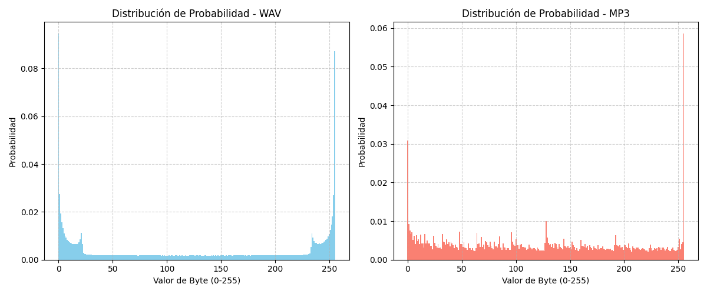

# Entropía empírica en señales de audio (WAV vs. MP3)

**Teoría de la Información — Práctico de Máquina 1, Ejercicio 1**

## Descripción

Este programa lee dos archivos de audio (uno en formato WAV y otro en formato MP3), valida sus cabeceras/formato, calcula la distribución de probabilidad ($p_i$) de aparición de cada byte (`0` a `255`) y, a partir de esa distribución, calcula la entropía empírica de ambas fuentes utilizando la fórmula de Shannon. Además, genera los histogramas de frecuencias de ambos archivos para su comparación visual.

Fórmula de Shannon:

$$H = -\sum_i p_i \log_2(p_i)$$

Para un byte existen 256 símbolos posibles, por lo que la entropía máxima teórica es:

$$H_{max} = \log_2(256) = 8\ bits/símbolo$$

## Uso

Para utilizarlo, se ejecuta desde la terminal indicando la ruta de cada archivo:

```bash
python main.py -w audio.wav -m audio.mp3
```

### Parámetros

    -h, --help      show this help message and exit
    -w, --wav WAV   Ruta al archivo de audio en formato WAV.
    -m, --mp3 MP3   Ruta al archivo de audio en formato MP3.

### Mostrar la ayuda

```bash
python main.py --help
```

Si el programa se ejecuta sin alguno de los dos parámetros obligatorios, `argparse` muestra el modo de uso e informa cuál falta.

## Ejemplo de salida

```text
### Validacion de archivos ###
Cabecera de archivo MP3: b'ID3'
Archivo MP3 validado correctamente.
Cabecera de archivo WAV: b'RIFF\x92\x1c \x00WAVE'
Archivo WAV validado correctamente.

### Analisis de cabecera de archivo WAV ###
  ChunkID: RIFF
  Tamaño archivo: 2104466
  Formato: WAVE
  Canales: 2
  Frecuencia de muestreo: 44100 Hz
  Bits por muestra: 16
  Tamaño de datos: 2104292 bytes

### Distribución de Probabilidades ###
Entropia archivo WAV: 6.9594 bits/símbolo
Entropia archivo MP3: 7.7278 bits/símbolo
```



Los valores son ilustrativos y dependen del contenido real de los archivos de audio utilizados.

## Explicación teórica (inciso f)

Los resultados obtenidos muestran una diferencia significativa entre la entropía y la distribución estadística de un archivo de audio WAV y su equivalente MP3. El archivo WAV presentó una entropía menor y un histograma con patrones más estructurados, reflejando la existencia de redundancias y correlaciones propias de la señal de audio original. En cambio, el archivo MP3 exhibió una entropía considerablemente mayor y un histograma más uniforme, indicando una distribución de símbolos cercana a la aleatoria.

Desde la Teoría de la Información, esta diferencia se debe a que los algoritmos de compresión buscan eliminar redundancias estadísticas y perceptuales presentes en la señal original. En el caso del MP3, además de aplicar técnicas de codificación eficientes, se descartan componentes sonoras consideradas poco relevantes para la percepción humana mediante modelos psicoacústicos. Como consecuencia, los datos resultantes contienen menos patrones repetitivos y una distribución de probabilidades más uniforme.

Un histograma uniforme implica que los símbolos poseen probabilidades similares de ocurrencia, lo que incrementa la entropía y reduce la redundancia explotable. Por esta razón, un archivo MP3 ya comprimido resulta mucho más difícil de comprimir nuevamente, mientras que un archivo WAV conserva una cantidad importante de información redundante susceptible de ser aprovechada por algoritmos de compresión.

En síntesis, la mayor entropía observada en el MP3 es una evidencia de que el proceso de compresión ha concentrado la información relevante y eliminado redundancias, acercando la entropía empírica de la fuente codificada a su límite teórico superior.

## Estructura del código

| Función | Responsabilidad |
|---|---|
| `validar_archivo` | Comprueba que la ruta exista y que la extensión corresponda al formato esperado (WAV o MP3). |
| `validar_formato_wav` / `validar_formato_mp3` | Verifican la cabecera real del archivo (`RIFF`/`WAVE` para WAV, `ID3` o sync frame para MP3), más allá de la extensión. |
| `leer_header_wav` | Lee y desempaqueta los primeros 44 bytes del archivo WAV, mostrando ChunkID, tamaño, formato, canales, frecuencia de muestreo y bits por muestra. |
| `calcular_distribucion_bytes` | Lee el archivo en modo binario, cuenta la frecuencia de cada byte (0-255) y devuelve el vector de probabilidades $p_i$. |
| `calcular_entropia_shannon` | Calcula la entropía de Shannon a partir de la distribución de probabilidades recibida. |
| `graficar_histograma` | Genera el histograma de frecuencias de un archivo para su comparación visual. |
| `parsear_argumentos` | Procesa las rutas de los archivos WAV y MP3 mediante `argparse`. |
| `main` | Coordina la validación, el análisis de cabecera, el cálculo de entropía y la generación de histogramas. |

## Notas

- El archivo WAV se valida tanto por extensión como por el contenido real de su cabecera (`RIFF`/`WAVE`), evitando falsos positivos si el archivo tiene la extensión correcta pero no es un WAV válido.
- Se recomienda utilizar un archivo `.wav` y un archivo `.mp3` que contengan exactamente la misma pista de audio, para que la comparación de entropía e histogramas sea representativa.
- Los histogramas se grafican sobre las 256 posiciones posibles de byte, permitiendo comparar visualmente la forma de ambas distribuciones.